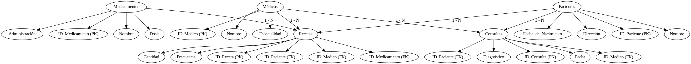

# Parte 1: Bases de Datos

En este ejercicio se presenta la base de datos de un centro médico. La misma está
diseñada para almacenar y gestionar información relacionada con pacientes, médicos,
recetas y consultas médicas. Su propósito es proporcionar una plataforma para registrar y
acceder a datos médicos críticos de manera eficiente y segura.

**Entidades:**
- Pacientes: Registra información detallada sobre los pacientes, incluyendo nombre, fecha de nacimiento y dirección.
- Médicos: Almacena detalles sobre los médicos que brindan atención médica, como nombre y especialidad.
- Medicamentos: Contiene una lista de medicamentos disponibles con detalles sobre dosis y administración.
- Consultas: Registra todas las consultas médicas realizadas, incluyendo fecha, médico y paciente involucrados, y diagnóstico.
- Recetas: Vincula pacientes con medicamentos prescritos por los médicos, incluyendo información sobre el medicamento, cantidad y frecuencia.

## Ejercicio 1

La base de datos descripta es una base de datos relacional. Esto lo pude determinar a partir de la estructura basada en tablas (las entidades están representadas de esta forma), la existencia de relaciones entre tablas y el uso de claves primarias y foráneas (cada tabla debe tener una clave primaria que identifica de manera única cada registro y claves foráneas que se utilizan para establecer relaciones entre tablas).

## Ejercicio 2

## Ejercicio 3

En primera instancia, la base de datos se encuentra normalizada. Para demostrar que efectivamente se encuentra normalizada, tomamos como criterio el cumplimiento de las primeras 3 Formas Normales.

La base que se proporciona para este trabajo no está normalizada porque Buenos Aires está escrita tanto en minúsculas como mayúsculas y hay nombres que están mal escritos (buenos bires). Para poder salvar estos problemas se podría utilizar un programa que no sea sensible a mayúsculas (para que no diferencie entre Buenos Aires con minúscula y mayúscula), a la vez que se debería solicitar un curado de la base de datos para corregir la localidad mal escrita correspondiente.

# Parte 2: SQL

## Ejercicio 1

Obtener el nombre y la dirección de los pacientes que viven en Buenos Aires.

Codigo utilizado

	SELECT nombre, calle, numero
	FROM pacientes
	WHERE ciudad = 'Buenos Aires';

Output

## Ejercicio 2

Obtener la cantidad de recetas emitidas por cada médico.

Codigo utilizado:

	SELECT medicos.nombre, COUNT(recetas.id_receta) AS cantidad_recetas
	FROM medicos
	JOIN recetas ON medicos.id_medico = recetas.id_medico
	GROUP BY medicos.nombre;

Output

## Ejercicio 3

Obtener el nombre de los pacientes junto con la fecha y el diagnóstico de todas las
consultas médicas realizadas en junio del 2024.

Codigo utilizado

	SELECT P.nombre, C.fecha, C.diagnostico
	FROM pacientes P
	JOIN consultas C ON P.id_paciente = C.id_paciente
	WHERE C.fecha BETWEEN '2024-06-01' AND '2024-06-30';

Output

## Ejercicio 4

Obtener el nombre de los medicamentos prescritos más de una vez por el médico
con ID igual a 2.

Codigo utilizado

	SELECT M.nombre, COUNT(R.id_receta) AS Cantidad_Prescripciones
	FROM recetas R
	JOIN medicamentos M ON R.id_medicamento = M.id_medicamento
	WHERE R.id_medico = 2
	GROUP BY M.nombre
	HAVING COUNT(R.id_receta) > 1;

Output

## Ejercicio 5

Obtener el nombre de los pacientes junto con la cantidad total de recetas que han
recibido.

Codigo Utilizado

	SELECT P.nombre, COUNT(R.id_receta) AS Cantidad_Recetas
	FROM pacientes P
	LEFT JOIN recetas R ON P.id_paciente = R.id_paciente
	GROUP BY P.nombre;

Output

## Ejercicio 6
Obtener el nombre del medicamento más recetado junto con la cantidad de recetas
emitidas para ese medicamento.

Codigo utilizado

	SELECT M.nombre, COUNT(R.id_receta) AS Cantidad_Recetas
	FROM recetas R
	JOIN medicamentos M ON R.id_medicamento = M.id_medicamento
	GROUP BY M.nombre
	ORDER BY Cantidad_Recetas DESC
	LIMIT 1;

Output

## Ejercicio 7

Obtener el nombre del paciente junto con la fecha de su última consulta y el
diagnóstico asociado.

Codigo utilizado

	SELECT P.nombre, C.fecha, C.diagnostico
	FROM pacientes P
	JOIN consultas C ON P.id_paciente = C.id_paciente
	WHERE C.fecha = (
	    SELECT MAX(C1.fecha)
	    FROM consultas C1
	    WHERE C1.id_paciente = P.id_paciente
	);

Output

## Ejercicio 8

Obtener el nombre del médico junto con el nombre del paciente y el número total de
consultas realizadas por cada médico para cada paciente, ordenado por médico y
paciente.

Codigo utilizado

	SELECT M.nombre AS Nombre_Medico, P.nombre AS Nombre_Paciente, COUNT(C.id_consulta) AS Total_Consultas
	FROM consultas C
	JOIN medicos M ON C.id_medico = M.id_medico
	JOIN pacientes P ON C.id_paciente = P.id_paciente
	GROUP BY M.nombre, P.nombre
	ORDER BY M.nombre, P.nombre;

Output

## Ejercicio 9

Obtener el nombre del medicamento junto con el total de recetas prescritas para ese
medicamento, el nombre del médico que lo recetó y el nombre del paciente al que se
le recetó, ordenado por total de recetas en orden descendente.

Codigo utilizado

	SELECT M.nombre AS Nombre_Medicamento, 
	       COUNT(R.id_receta) AS Total_Recetas, 
	       Med.nombre AS Nombre_Medico, 
	       P.nombre AS Nombre_Paciente
	FROM recetas R
	JOIN medicamentos M ON R.id_medicamento = M.id_medicamento
	JOIN medicos Med ON R.id_medico = Med.id_medico
	JOIN pacientes P ON R.ID_Paciente = P.ID_Paciente
	GROUP BY M.nombre, Med.nombre, P.nombre
	ORDER BY Total_Recetas DESC;

Output

## Ejercicio 10

Obtener el nombre del médico junto con el total de pacientes a los que ha atendido,
ordenado por el total de pacientes en orden descendente.

Codigo utilizado

	SELECT M.nombre AS Nombre_Medicamento, COUNT(R.id_receta) AS Total_Recetas, 
	       T.nombre AS Nombre_Medico, P.nombre AS Nombre_Paciente
	FROM recetas R
	JOIN medicamentos M ON R.id_medicamento = M.id_medicamento
	JOIN medicos T ON R.id_medico = T.id_medico
	JOIN pacientes P ON R.ID_Paciente = P.ID_Paciente
	GROUP BY M.nombre, T.nombre, P.nombre
	ORDER BY Total_Recetas DESC;

Output

